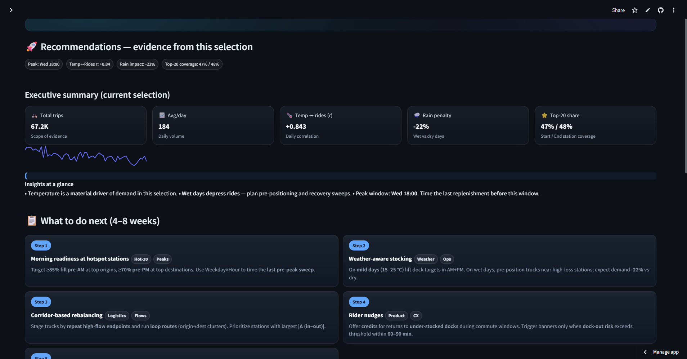

# 🚲 NYC Citi Bike — 2022 Weather & Usage Analytics
_Analyzing how weather, time and station dynamics drive ride-share behaviour in NYC_

[](https://citi-bike-2022-weather-yewjc77stq3kroa9s8ffrm.streamlit.app/)


**Interactive, decision-oriented dashboard** that explores how **weather** shapes **Citi Bike demand** across New York City in **2022**.  
It highlights seasonality, station concentration (Pareto), OD flows, diurnal patterns, and includes a **What-If** tool to estimate rides at a given temperature.

> 🔴 **Live app:** [citi-bike-2022-weather.streamlit.app](https://citi-bike-2022-weather-jtseqkottmbuxcuwhytxhl.streamlit.app)
💻 Python · 📊 Streamlit · 🗺️ Geospatial · 🔍 Data-Storytelling

## 🧭 Purpose  
Explore 2022 ride-share data from :contentReference[oaicite:0]{index=0} in New York City through the lens of weather, time, station dynamics and user behaviour — then turn the insights into actionable recommendations.

---

## 🗂️ Table of Contents  
- [✨ Highlights](#-highlights)  
- [🖼️ Screenshots](#️-screenshots)  
- [⚙️ How it Works](#️-how-it-works)  
- [🌦️ Data](#️-data)  
- [📊 Features by Page](#-features-by-page)  
- [📈 KPIs](#-kpis)  
- [🧰 Tech Stack](#-tech-stack)  
- [💻 Local Setup](#-local-setup)  
- [📁 Repository Structure](#-repository-structure)  
- [🗺️ Roadmap](#️-roadmap)  
- [📜 License & Attribution](#-license--attribution)  
- [👥 Contributors & Contact](#-contributors--contact)

---

## ✨ Highlights  
- 🌡️ **Weather ↔ Usage correlation** with dual-axis line + scatter views  
- 🧊 **Comfort window** for 15–25 °C riding conditions  
- 🚉 **Station intelligence:** Pareto share, Hot-20 coverage, and imbalance  
- 🧭 **OD Flows & Matrix:** map + Sankey + corridors  
- 📆 **Temporal patterns:** weekday × hour heatmap  
- ⚙️ **Evidence-based Recommendations Engine** with KPIs & pilot plan  
- 🎨 Clean UX: gradient cards, URL-synced filters, polished typography  
- 👤 **Author credits** displayed at sidebar bottom

---

## 🖼️ Screenshots  

| Page | Preview |
|------|----------|
| **Intro & KPIs** |  |
| **Weather vs Usage** |  |
| **Pareto & Top Stations** |  |
| **OD Flows (Sankey)** |  |
| **Heatmap (Weekday×Hour)** |  |
| **Recommendations** |  |

---

## ⚙️ How it Works

- Loads processed trip + weather dataset: `data/processed/reduced_citibike_2022.csv`  
- Normalizes dates → builds **daily table** automatically  
- Calculates temperature elasticity, rain penalty, and top-station shares  
- Uses cached aggregations for speed and reproducibility  
- All visuals auto-refresh with sidebar filters and query-string state

---

## 🌦️ Data  
| Source | Description |
|--------|-------------|
| 🚲 **Citi Bike NYC (2022)** | Ride-level trip data |
| 🌤️ **Weather feed (NOAA)** | Avg temp °C, precipitation mm, wind kph, humidity |
| 🗺️ **Optional maps** | Kepler.gl HTML exports in `reports/map/` |

Expected columns:  
`ride_id`, `started_at`, `start_station_name`, `end_station_name`, `date`, `bike_rides_daily`, `avg_temp_c`, `wet_day`

> 💡 App auto-detects column name variants (`avgTemp`, `temperature_c`, etc.).

---

## 📊 Features by Page  

### 🏠 Intro  
- Cover image + KPI cards: Total Trips | Avg/Day | Temp Impact | Weather Impact | Peak Season  
- Auto-syncs state with URL parameters  

### 🌤️ Weather vs Bike Usage  
- Dual-axis rides vs temperature (14-day smoother)  
- Scatter plot + OLS trendline colored by precip bin  
- Highlights comfort window (15–25 °C)  

### 📈 Trip Metrics (Duration • Distance • Speed)  
- Distributions & summary stats for ride lengths & speeds  
- Filterable by user type and time window  

### 👥 Member vs Casual Profiles  
- Behavioural comparison: ride duration, start hours, distance  
- Differentiates commuters vs leisure riders  

### 📊 Pareto — Share of Rides  
- Cumulative distribution showing Hot-20 coverage  
- Reveals concentration of usage by station  

### 🚉 Station Popularity  
- Top N stations (by starts and ends) + CSV export  
- Clean labels & interactive bars  

### 🔀 OD Flows — Sankey + Map  
- Visualizes top Origin→Destination pairs  
- Optional Kepler map overlay  

### 🔢 OD Matrix — Top Origins × Dest  
- Compact matrix of high-traffic station pairs  
- Basis for corridor-based rebalancing  

### ⚖️ Station Imbalance (In vs Out)  
- Computes Δ (in−out) for each station  
- Identifies stocking & return pressure points  

### ⏰ Weekday × Hour Heatmap  
- 7×24 matrix showing temporal load  
- Pinpoints commute windows for truck staging  

### 🚀 Recommendations  
- **Executive Summary Cards:** total trips, avg/day, temp ↔ rides (r), rain penalty, Hot-20 coverage  
- **Insights at a Glance:** auto-bullets from your selection (e.g., “wet days depress rides”)  
- **Action Plan (4–8 weeks):** readiness targets, weather-aware stocking, corridor loops, rider nudges, Pareto focus  
- **KPIs to Track:** Dock-out @ peaks < 5% | Complaints −30% MoM | Truck km per rebalance −15% | On-time readiness ≥ 90%  
- **Hot-20 Pilot Plan:** top |Δ (in−out)| stations + AM/PM targets (85 / 70%) + CSV export  
- **Evidence Tabs:** imbalance table, rides-vs-temp trend, summary CSV  

> 💡 Author credentials (GitHub · LinkedIn · Email) appear at the bottom of the sidebar.

---

## 📈 KPIs  

| Metric | Target | Description |
|---------|--------|-------------|
| 🧮 Total Trips |  — | Scope of selection |
| 📅 Avg/Day |  — | Daily volume |
| 🌡️ Temp ↔ Rides (r) |  — | Weather elasticity |
| 🌧️ Rain Penalty |  — | Wet vs dry day impact (%) |
| 🏆 Hot-20 Coverage |  60–70% | Share of starts / ends |

---

## 🧰 Tech Stack  
- 🖥️ Streamlit 1.x (UI + interactivity)  
- 📊 Plotly (express + graph_objects)  
- 🧮 Pandas / NumPy (data processing)  
- 🗺️ Kepler.gl (optional map embed)  
- 🧠 Scikit-learn & SciPy (optional ML helpers)  
- 🐍 Python 3.10 +

---

## 💻 Local Setup

```bash
# 1️⃣ Clone the repo
git clone https://github.com/moeinmmm70/citi-bike-2022-weather.git
cd citi-bike-2022-weather

# 2️⃣ Create & activate virtual environment
python -m venv .venv
source .venv/bin/activate  # Windows: .venv\Scripts\activate

# 3️⃣ Install dependencies
pip install -r requirements.txt
# or minimal
pip install streamlit pandas numpy plotly

# 4️⃣ Add your processed dataset
# (≤25 MB daily or trip-level sample)
data/processed/reduced_citibike_2022.csv

# 5️⃣ Optional: Add maps
reports/map/citibike_trip_flows_2022.html

# 6️⃣ Run the app
streamlit run app/st_dashboard_Part_2.py
```
## 📁 Repository Structure

> 📂 Click through to explore folders/files in this repo.

- [`app/`](app/)  
  - [`st_dashboard_Part_2.py`](app/st_dashboard_Part_2.py) — Main Streamlit app (multi-page)  
  - [`requirements.txt`](app/requirements.txt) — Dependencies for local/dev/Cloud
- [`data/`](data/)  
  - [`raw/`](data/raw/) — Raw trip & weather data *(git-ignored; placeholder only)*  
  - [`processed/`](data/processed/)  
    - [`reduced_citibike_2022.csv`](data/processed/reduced_citibike_2022.csv) — **≤25 MB** sample used by the app
- [`notebooks/`](notebooks/) — Jupyter notebooks for download, cleaning, merging, sampling  
- [`reports/`](reports/)  
  - [`map/`](reports/map/)  
    - [`citibike_trip_flows_2022.html`](reports/map/citibike_trip_flows_2022.html)  
    - [`NYC_Bike_Trips_Aggregated.html`](reports/map/NYC_Bike_Trips_Aggregated.html) — Kepler.gl map exports (optional)
- [`.gitignore`](.gitignore) — excludes large data and local artifacts  
- [`README.md`](README.md) — you are here

> 💡 **Note:** Large raw datasets are intentionally **excluded** from version control. Only the processed sample is tracked for reproducibility.

## ⚡ Performance Notes

- Optimized for **≤25 MB** data — runs smoothly on Streamlit Cloud  
- Uses `@st.cache_data` for efficient reloading  
- Converts station names to `category` dtype for memory efficiency  
- Daily aggregations cached and reused across visualizations  

---

## 🗺️ Roadmap

- 🌧️ Add multivariate weather model (temp + precip)  
- 🔮 ARIMA/Prophet forecast module 
- 🛰️ Station-level anomaly detection  
- 📤 Export to PDF/PNG reports  
- 📆 Year selector for 2023–2024 datasets  

---

## 📜 License & Attribution

- Code licensed under **MIT** (open & reusable)  
- Data from **Citi Bike NYC** and public weather sources  
- _This project is not affiliated with Citi Bike._  

```bash
Mellat, Moein. 2025. *NYC Citi Bike — 2022 Weather & Usage Analytics: 
Interactive Streamlit Dashboard for Exploring Weather Impacts on Urban Mobility.*  
GitHub Repository. https://github.com/moeinmmm70/citi-bike-2022-weather
```

---

## 👥 Contributors & Contact  

**👤 Project Lead — Moein Mellat, PhD**  
Environmental Engineer · Data Analyst · Streamlit Developer  

🌐 [GitHub](https://github.com/moeinmmm70) | 💼 [LinkedIn](https://www.linkedin.com/in/moeinmellat/) | 📧 [moein.mellat@gmail.com](mailto:moein.mellat@gmail.com)  

---

### 🙏 Acknowledgments  

- **Citi Bike NYC** — for open trip data  
- **Streamlit Community** — for a brilliant framework  
- **Plotly & Pandas Teams** — for beautiful APIs  
- **Hlib Havryliuk** — for repository structure inspiration  
- **Open-Source Ecosystem** — for making data science accessible  

---

### ❤️ Credits  

Built with passion by **Moein Mellat**  
For curious minds and data-driven urban explorers 🌆
