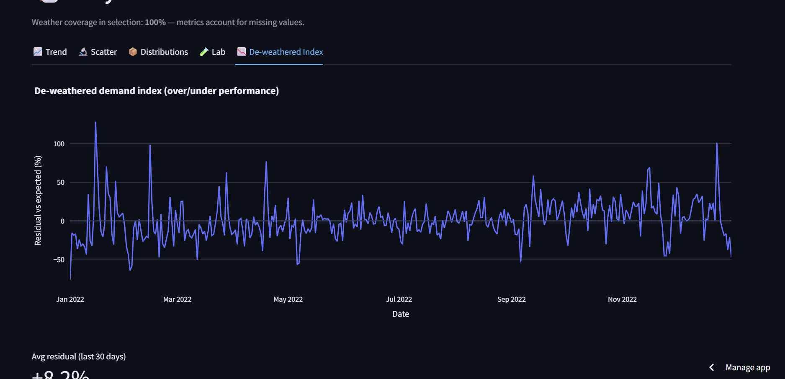
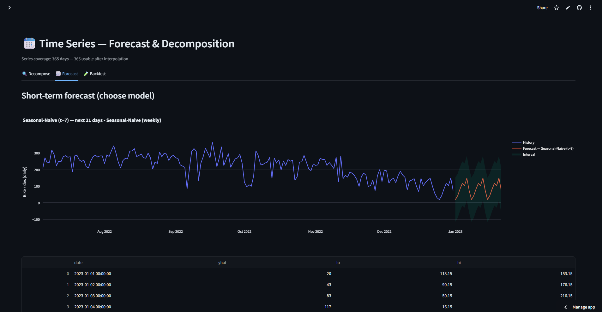

# 🚲 NYC Citi Bike — 2022 Weather & Usage Analytics
_Analyzing how weather, time and station dynamics drive ride-share behaviour in NYC_

[](https://citi-bike-2022-weather-jtseqkottmbuxcuwhytxhl.streamlit.app/)


**Interactive, decision-oriented dashboard** that explores how **weather** shapes **Citi Bike demand** across New York City in **2022**.  
It highlights seasonality, station concentration (Pareto), OD flows, diurnal patterns, and includes a **What-If** tool to estimate rides at a given temperature.

> 🔴 **Live app:** [citi-bike-2022-weather.streamlit.app](https://citi-bike-2022-weather-jtseqkottmbuxcuwhytxhl.streamlit.app)
💻 Python · 📊 Streamlit · 🗺️ Geospatial · 🔍 Data-Storytelling

---

## 🧭 Purpose  

**Situation → Task → Action → Result**

- **Situation:** NYC’s bike-sharing network logs millions of rides yearly, but demand fluctuates wildly with temperature, rain, and commuting patterns.  
- **Task:** Build a transparent analytical tool to quantify those effects and help decision-makers anticipate usage and rebalance bikes efficiently.  
- **Action:** Combine Citi Bike 2022 data with NOAA weather records, engineer daily metrics, visualize correlations, and deploy a modular multi-page Streamlit dashboard.  
- **Result:** A fast, visually clean web app that turns raw trip data into operational insight — demonstrating end-to-end analytics, data-storytelling, and app deployment.

---

## 🗂️ Table of Contents  
- [✨ Highlights](#-highlights)  
- [🖼️ Screenshots](#️-screenshots)  
- [⚙️ How it Works](#️-how-it-works)  
- [🌦️ Data](#️-data)  
- [📊 Features by Page](#-features-by-page)  
- [📆 Time Series — Forecast & Decomposition](#-time-series--forecast--decomposition)  
- [📈 KPIs](#-kpis)  
- [🧰 Tech Stack](#-tech-stack)  
- [💻 Local Setup](#-local-setup)  
- [📁 Repository Structure](#-repository-structure)  
- [⚡ Performance Notes](#-performance-notes)  
- [🧭 Sidebar UX](#-sidebar-ux)  
- [🗺️ Roadmap](#️-roadmap)  
- [📜 License & Attribution](#-license--attribution)  
- [👥 Contributors & Contact](#-contributors--contact)

---

## ✨ Highlights  

- 🌡️ **Weather ↔ Usage correlation:** Dual-axis line + scatter views showing how temperature and rain affect ridership.  
- 🧊 **Comfort window:** Optimal riding zone between 15 – 25 °C.  
- 📉 **De-weathered Index:** Residual demand signal after removing temperature influence (shows underlying mobility).  
- 🔮 **Time Series:** STL decomposition + forecasts using Naive, Seasonal-Naive, 7-day MA, optional SARIMAX, and De-weathered + Seasonal-Naive models with backtesting.  
- 🚉 **Station intelligence:** Pareto share, Hot-20 coverage, and imbalance metrics for rebalancing.  
- 🧭 **OD Flows & Matrix:** Sankey + pydeck Arc map with diagnostics and CSV downloads.  
- 📆 **Temporal patterns:** Weekday×Hour heatmap with Row %, Col %, Z-score, and Wet vs Dry comparison.  
- ⚙️ **Recommendations Engine:** Data-driven actions, measurable KPIs, pilot plan, downloadable CSV summaries, risk flags, and YouTube embed.  
- 🎛️ **UX niceties:** Quick presets, URL-synced filters, “copy link” action, and accent theme toggle.  
- 💡 **Result:** End-to-end data product — clean code, reproducible analysis, and executive-grade visuals.

---

## 🖼️ Screenshots  

| Page | Preview |
|------|----------|
| **Intro & KPIs** |  |
| **Weather vs Usage** |  |
| **De-weathered Index** |  |
| **Top Stations** |  |
| **OD Flows (Sankey + Map)** |  |
| **Weekday×Hour Heatmap** |  |
| **Forecast & Decomposition** |  |
| **Recommendations** |  |

---

## ⚙️ How it Works  

- Loads processed dataset `data/processed/reduced_citibike_2022.csv`.  
- Normalizes and aggregates trip + weather data to daily level.  
- Computes temperature elasticity, rain penalty, station-level KPIs, and Pareto shares.  
- Generates a **De-weather model** (y = b₀ + b₁·temp; residuals used for “true demand”).  
- Integrates forecasting (STL, Naive, SARIMAX) and backtesting tools.  
- Caches aggregations for speed and uses **URL-synced filters** so links reproduce views.  
- Provides **Quick presets**, **accent theme**, and **copy-link action** for better UX.  

**Result:** A reproducible, lightweight, and fully interactive app that runs smoothly on Streamlit Cloud (< 25 MB dataset).

---

## 🌦️ Data  

| Source | Description |
|--------|-------------|
| 🚲 **Citi Bike NYC (2022)** | Ride-level trip data (12 monthly CSVs) |
| 🌤️ **NOAA Weather Feed** | Avg Temp °C, Precip mm, Wind kph, Humidity |
| 🗺️ **Kepler.gl Maps** | Optional HTML exports (`reports/map/`) |

Expected columns:  
`ride_id`, `started_at`, `start_station_name`, `end_station_name`, `date`, `bike_rides_daily`, `avg_temp_c`, `wet_day`  

> 💡 App auto-detects column name variants (`avgTemp`, `temperature_c`, etc.).

---

## 📊 Features by Page  

### 🏠 Intro  
- Hero panel + KPI cards: Total Trips, Avg/Day, Temp ↔ Rides, Weather Impact, Peak Season.  
- Auto-syncs state with URL parameters.

### 🌤️ Weather vs Bike Usage  
- Tabs: **Trend**, **Scatter**, **Distributions**, **Lab**, and **📉 De-weathered Index**.  
- OLS trendline + comfort band (15–25 °C).  

### 📈 Trip Metrics (Duration • Distance • Speed)  
- Distribution and summary stats for ride lengths and speeds; filterable by user type and time.

### 👥 Member vs Casual Profiles  
- Behavioural comparison of ride duration, start hours, and distance; shows commuter vs leisure patterns.

### 📊 Pareto — Share of Rides  
- Cumulative distribution showing Hot-20 coverage and station concentration.

### 🚉 Station Popularity  
- Top-N stations (by starts/ends) with interactive bars and CSV export.

### 🔀 OD Flows — Sankey + Map  
- Visualizes top Origin→Destination pairs as Sankey and **pydeck Arc map**.  
- Controls for time-slice, top-k, and member split; **download OD edges (CSV)**.

### 🔢 OD Matrix — Top Origins × Destinations  
- Top-O×Top-D matrix; normalization (None / Row / Col); log scaling and diagnostic stats + download.

### ⚖️ Station Imbalance (In vs Out)  
- Computes Δ(in−out) per station → identifies stocking and return pressure points.

### ⏰ Weekday × Hour Heatmap  
- 7×24 matrix showing temporal load patterns; modes: Row %, Col %, Z-score, Wet vs Dry.

### 📆 Time Series — Forecast & Decomposition  
- **STL Decomposition** (seasonal = 7 days).  
- Forecast methods: Naive, Seasonal-Naive, 7-day MA, optional **SARIMAX**, and **De-weathered + Seasonal-Naive**.  
- **Backtest mode** for rolling error metrics; visualizes forecast bands.

### 🚀 Recommendations  
- Executive KPIs cards + auto-generated insights.  
- **4–8 week Action Plan:** stocking targets, corridor loops, incentives.  
- **KPIs:** Dock-out < 5 %, Complaints −30 % MoM, Truck km −15 %.  
- **Downloads:** Summary CSV + pilot table; risk flags & assumptions; embedded YouTube clip.  

> 💡 Author credentials (GitHub · LinkedIn · Email) appear at the bottom of the sidebar.

---

## 📈 KPIs  

| Metric | Target | Description |
|---------|--------|-------------|
| 🧮 Total Trips | — | Scope of selection |
| 📅 Avg/Day | — | Daily volume |
| 🌡️ Temp ↔ Rides (r) | — | Weather elasticity |
| 🌧️ Rain Penalty | — | Wet vs Dry impact (%) |
| 🏆 Hot-20 Coverage | 60 – 70 % | Share of starts/ends |

---

## 🧰 Tech Stack  

- 🖥️ Streamlit 1.x (UI + interactivity)  
- 📊 Plotly (express + graph_objects)  
- 🧮 Pandas / NumPy (data processing)  
- 🗺️ Kepler.gl (optional map embed)  
- 🧠 Scikit-learn & SciPy (optional ML helpers)  
- 🐍 Python 3.10 +

---

## 💻 Local Setup

```bash
# 1️⃣ Clone the repo
git clone https://github.com/moeinmmm70/citi-bike-2022-weather.git
cd citi-bike-2022-weather

# 2️⃣ Create & activate virtual environment
python -m venv .venv
source .venv/bin/activate  # Windows: .venv\Scripts\activate

# 3️⃣ Install dependencies
pip install -r requirements.txt
# or minimal
pip install streamlit pandas numpy plotly

# 4️⃣ Add processed dataset
# (≤25 MB daily or trip-level sample)
data/processed/reduced_citibike_2022.csv

# 5️⃣ Add maps
reports/map/citibike_trip_flows_2022.html

# 6️⃣ Run the app
streamlit run app/st_dashboard_Part_2.py
```
## 📁 Repository Structure

> 📂 Click through to explore folders/files in this repo.

- [`app/`](app/)  
  - [`st_dashboard_Part_2.py`](app/st_dashboard_Part_2.py) — Main Streamlit app (multi-page)  
  - [`requirements.txt`](app/requirements.txt) — Dependencies for local/dev/Cloud
- [`data/`](data/)  
  - [`raw/`](data/raw/) — Raw trip & weather data *(git-ignored; placeholder only)*  
  - [`processed/`](data/processed/)  
    - [`reduced_citibike_2022.csv`](data/processed/reduced_citibike_2022.csv) — **≤25 MB** sample used by the app
- [`notebooks/`](notebooks/) — Jupyter notebooks for download, cleaning, merging, sampling  
- [`reports/`](reports/)  
  - [`map/`](reports/map/)  
    - [`citibike_trip_flows_2022.html`](reports/map/citibike_trip_flows_2022.html)  
    - [`NYC_Bike_Trips_Aggregated.html`](reports/map/NYC_Bike_Trips_Aggregated.html) — Kepler.gl map exports (optional)
- [`.gitignore`](.gitignore) — excludes large data and local artifacts  
- [`README.md`](README.md) — you are here

> 💡 **Note:** Large raw datasets are intentionally **excluded** from version control. Only the processed sample is tracked for reproducibility.

---

## ⚡ Performance Notes  

- Optimized for **≤ 25 MB** dataset → runs smoothly on Streamlit Cloud.  
- Uses `@st.cache_data` for efficient reloading and state management.  
- Converts station names to `category` dtype for memory optimization.  
- Reuses daily aggregations across visualizations to avoid recomputation.  

---

## 🗺️ Roadmap  

- 🌧️ Add multivariate model combining temperature + precipitation  
- 🔮 Extend forecasting with ARIMA / Prophet modules  
- 🛰️ Integrate station-level anomaly detection  
- 📤 Enable PDF / PNG report export  
- 📆 Include 2023–2024 datasets  

---

## 📜 License & Attribution  

- Code licensed under **MIT** (open & reusable)  
- Data from **Citi Bike NYC** and public weather sources  
- _This project is independent of Citi Bike LLC._  

```bash
Mellat, Moein. 2025. *NYC Citi Bike — 2022 Weather & Usage Analytics: 
Interactive Streamlit Dashboard for Exploring Weather Impacts on Urban Mobility.*  
GitHub Repository. https://github.com/moeinmmm70/citi-bike-2022-weather
```

---

## 👥 Contributors & Contact  

**👤 Project Lead — Moein Mellat, PhD**  
Environmental Engineer · Data Analyst · Streamlit Developer  

🌐 [GitHub](https://github.com/moeinmmm70) | 💼 [LinkedIn](https://www.linkedin.com/in/moeinmellat/) | 📧 [moein.mellat@gmail.com](mailto:moein.mellat@gmail.com)  

---

### 🙏 Acknowledgments  

- **Citi Bike NYC** — for open trip data  
- **Streamlit Community** — for a brilliant framework  
- **Plotly & Pandas Teams** — for beautiful APIs  
- **Hlib Havryliuk** — for repository structure inspiration  
- **Open-Source Ecosystem** — for making data science accessible  

---

### ❤️ Credits  

Built with passion by **Moein Mellat**  
For curious minds and data-driven urban explorers 🌆
