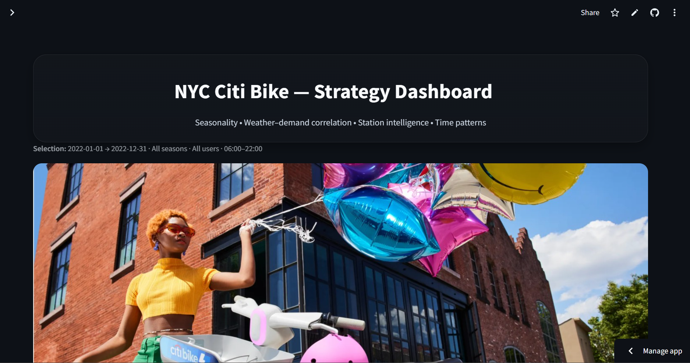
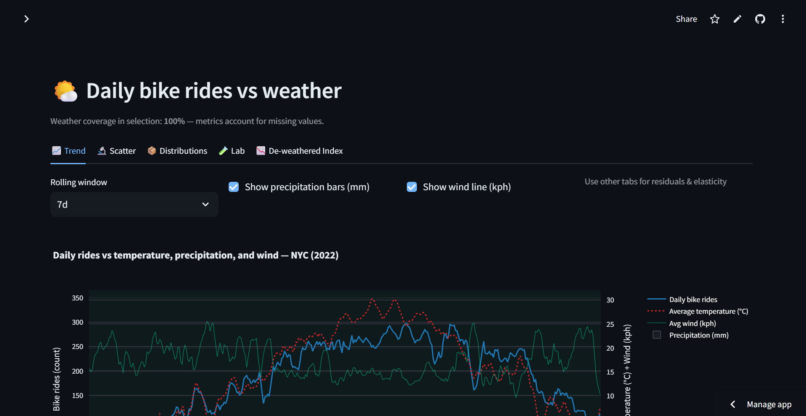
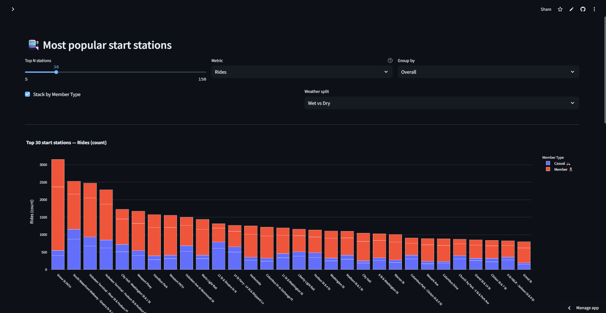
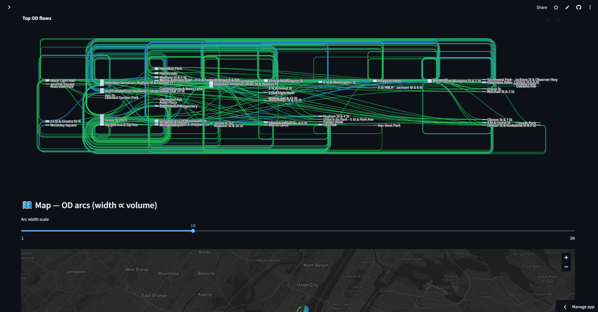

# 🚲 NYC Citi Bike — 2022 Weather & Usage Analytics

[](https://citi-bike-2022-weather-yewjc77stq3kroa9s8ffrm.streamlit.app/)


**Interactive, decision-oriented dashboard** that explores how **weather** shapes **Citi Bike demand** across New York City in **2022**.  
It highlights seasonality, station concentration (Pareto), OD flows, diurnal patterns, and includes a **What-If** tool to estimate rides at a given temperature.

> 🔴 **Live app:** [citi-bike-2022-weather.streamlit.app](https://citi-bike-2022-weather-yewjc77stq3kroa9s8ffrm.streamlit.app/)

---

## 🧭 Table of Contents
- [✨ Highlights](#-highlights)
- [🖼️ Screenshots](#️-screenshots)
- [⚙️ How it Works](#️-how-it-works)
- [🌦️ Data](#️-data)
- [📊 Features by Page](#-features-by-page)
- [📈 KPIs](#-kpis)
- [🧰 Tech Stack](#-tech-stack)
- [💻 Local Setup](#-local-setup)
- [📁 Repository Structure](#-repository-structure)
- [⚡ Performance Notes](#-performance-notes)
- [🗺️ Roadmap](#️-roadmap)
- [🤝 Contributing](#-contributing)
- [📜 License & Attribution](#-license--attribution)
- [❓ FAQ / Troubleshooting](#-faq--troubleshooting)

---

## ✨ Highlights

- 🌡️ **Weather ↔ Usage correlation** with dual-axis time series & scatter + linear fit  
- 🧊 **Comfort Index** + **precipitation bins** to visualize weather impacts  
- 🚉 **Station Intelligence**: Top stations, Pareto concentration, Sankey OD flows, Kepler.gl map  
- 📆 **Temporal Patterns**: Weekday × hour heatmap, monthly trend with moving average  
- 🧮 **What-If Simulator**: predict expected rides given an average temperature  
- 🧭 Clean UX: hero cover, KPI cards, intuitive sidebar filters  
- 🏷️ **Friendly labels** (no raw column names like `start_station_name`)

---

## 🖼️ Screenshots

> Replace with your own images stored under `reports/screenshots/`.

- **Intro & KPIs**  
  

- **Weather vs Usage**  
  

- **Top Stations & Pareto**  
  

- **Trip Flows (Sankey/Kepler)**  
  

- **Weekday × Hour Heatmap**  
  

---

## ⚙️ How it Works

- Loads a lightweight CSV (≤ ~25 MB) at `data/processed/reduced_citibike_2022.csv`
- Normalizes dates and derives **season**; creates a **daily table** automatically if needed
- Adds optional weather signals (temperature, precipitation bin, wind) and a **Comfort Index**
- Sidebar filters for **date range, season, user type, temperature**
- Charts are fully **interactive Plotly visuals**, updated dynamically with filters

---

## 🌦️ Data

- **Trips:** Citi Bike NYC (2022)  
  App expects a reduced sample or daily aggregate at:
data/processed/reduced_citibike_2022.csv

Columns automatically detected:
- Trip-level → `started_at`, `start_station_name`, `end_station_name`, `member_casual` / `usertype`
- Daily-level → `date`, `bike_rides_daily`
- **Weather:** merged daily metrics (optional) → `avg_temp_c`, `precip_mm`, `wind_kph`, `humidity`
- **Map HTMLs (optional):**
- `reports/map/citibike_trip_flows_2022.html`
- `reports/map/NYC_Bike_Trips_Aggregated.html`

> 💡 The app auto-detects column alternatives (`avgTemp`, `avg_temp`, `temperature_c`).

---

## 📊 Features by Page

### 🏠 Intro
- Cover image: `reports/cover_bike.webp`  
- KPI cards show:
- 🧮 **Total Trips**
- 📅 **Daily Average**
- 🌡️ **Temp Impact**
- 🌦️ **Weather Impact**
- 🏆 **Peak Season**

### 🌤️ Weather vs Bike Usage
- Dual-axis: **Rides vs Temperature**
- Overlay: **Comfort Index**
- Scatter + regression line colored by precipitation bin

### 📊 Correlation & Distributions
- Daily **correlation matrix** of metrics (rides, temp, wind, precip)
- **Seasonal violin** plots of ride distributions
- **Box plots** for precipitation categories

### 🍂 Seasonal Patterns
- **Monthly rides** with 3-month moving average
- **Top stations per season** — facet charts with readable station names

### 🚉 Station Popularity
- Top N start stations (with CSV export)
- Clear labels & tooltips

### 📈 Pareto: Share of Rides
- Cumulative curve → identify top share of stations (e.g., “Top 20% = 80% of rides”)

### 🗺️ Trip Flows Map
- Embed Kepler.gl map (if available)
- Sankey: top 20 origin–destination flows

### ⏰ Weekday × Hour Heatmap
- 7×24 matrix showing temporal load patterns

### 🧪 What-If: Temp → Rides
- Linear model: `rides ≈ a × temp + b`
- Slider to simulate expected rides by temperature

### 🚀 Recommendations
- 🔧 Ops tips: staging, commute windows, OD corridors, anomalies

---

## 📈 KPIs

| KPI | Description |
|------|-------------|
| 🧮 **Total Trips** | Total rides in the selected range |
| 📅 **Daily Average** | Average rides per day |
| 🌡️ **Temp ↔ Rides** | Correlation coefficient between temperature and rides |
| 🌦️ **Weather Impact** | % uplift for good vs bad weather |
| 🏆 **Peak Season** | Season with the highest average rides |

---

## 🧰 Tech Stack

- 🖥️ **Streamlit** — UI and interactivity  
- 🧮 **Pandas / NumPy** — data processing  
- 📊 **Plotly** — visualization engine  
- 🗺️ **Kepler.gl** — spatial mapping *(optional)*  
- 🐍 **Python 3.10+**

---

## 💻 Local Setup

```bash
# 1️⃣ Clone the repo
git clone https://github.com/moeinmmm70/citi-bike-2022-weather.git
cd citi-bike-2022-weather

# 2️⃣ Create & activate virtual environment
python -m venv .venv
source .venv/bin/activate  # Windows: .venv\Scripts\activate

# 3️⃣ Install dependencies
pip install -r requirements.txt
# or minimal
pip install streamlit pandas numpy plotly

# 4️⃣ Add your processed dataset
# (≤25 MB daily or trip-level sample)
data/processed/reduced_citibike_2022.csv

# 5️⃣ Optional: Add maps
reports/map/citibike_trip_flows_2022.html

# 6️⃣ Run the app
streamlit run app/st_dashboard_Part_2.py
```
## 📁 Repository Structure

> 📂 Click through to explore folders/files in this repo.

- [`app/`](app/)  
  - [`st_dashboard_Part_2.py`](app/st_dashboard_Part_2.py) — Main Streamlit app (multi-page)  
  - [`requirements.txt`](app/requirements.txt) — Dependencies for local/dev/Cloud
- [`data/`](data/)  
  - [`raw/`](data/raw/) — Raw trip & weather data *(git-ignored; placeholder only)*  
  - [`processed/`](data/processed/)  
    - [`reduced_citibike_2022.csv`](data/processed/reduced_citibike_2022.csv) — **≤25 MB** sample used by the app
- [`notebooks/`](notebooks/) — Jupyter notebooks for download, cleaning, merging, sampling  
- [`reports/`](reports/)  
  - [`map/`](reports/map/)  
    - [`citibike_trip_flows_2022.html`](reports/map/citibike_trip_flows_2022.html)  
    - [`NYC_Bike_Trips_Aggregated.html`](reports/map/NYC_Bike_Trips_Aggregated.html) — Kepler.gl map exports (optional)
- [`.gitignore`](.gitignore) — excludes large data and local artifacts  
- [`README.md`](README.md) — you are here

> 💡 **Note:** Large raw datasets are intentionally **excluded** from version control. Only the processed sample is tracked for reproducibility.

## ⚡ Performance Notes

- Optimized for **≤25 MB** data — runs smoothly on Streamlit Cloud  
- Uses `@st.cache_data` for efficient reloading  
- Converts station names to `category` dtype for memory efficiency  
- Daily aggregations cached and reused across visualizations  

---

## 🗺️ Roadmap

- 🌧️ Add precipitation & wind to the What-If model (multivariate)  
- 📈 Integrate **ARIMA/Prophet** forecasting for seasonal demand  
- 🚨 Detect station-level anomalies (events, outages)  
- 📄 Export insights as PDF/PNG reports  
- 🔁 Year switcher for 2023/2024 datasets  

---

## 🤝 Contributing

Pull requests are welcome!  
You can help improve:
- 🧮 Data preprocessing scripts  
- 🎨 Visual styling (Plotly layouts, annotations)  
- 🔬 Modeling enhancements (comfort index, weather imputation)  

---

## 📜 License & Attribution

- Code licensed under **MIT** (open & reusable)  
- Data from **Citi Bike NYC** and public weather sources  
- _This project is not affiliated with Citi Bike._  

```bash
Mellat, Moein. 2025. *NYC Citi Bike — 2022 Weather & Usage Analytics: 
Interactive Streamlit Dashboard for Exploring Weather Impacts on Urban Mobility.*  
GitHub Repository. https://github.com/moeinmmm70/citi-bike-2022-weather
```

---

## ❓ FAQ / Troubleshooting

**⚠️ App says “data file missing.”**  
→ Ensure `data/processed/reduced_citibike_2022.csv` exists (use small daily sample).

**🗺️ Kepler map page blank.**  
→ Place one of the HTMLs in `reports/map/`.

**🌡️ Missing temperature values.**  
→ Provide a column named `avg_temp_c` (or alias: `avgTemp`, `avg_temp`, `temperature_c`).

**🧾 Axis labels look raw.**  
→ The app auto-renames columns (e.g., “Start Station” instead of `start_station_name`).

---

### 🙌 Credits

Built with ❤️ by **Moein Mellat**  
Made for curious minds and data-driven urban explorers.
